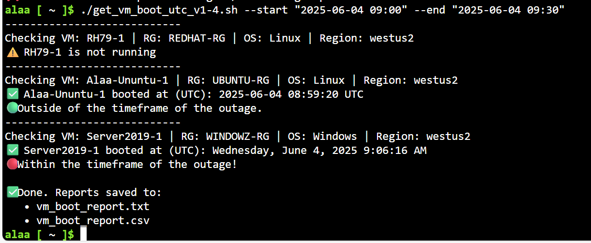

# Azure VM Boot Time Audit Script

This Bash script retrieves the last boot time (in UTC) of all or selected Azure virtual machines in a subscription, allowing you to determine if a VM was rebooted during a known outage window.

This is mainly for:

- Quickly identifying which VMs were restarted during a platform event

- Verifying VM behavior when Azure doesn’t log platform-initiated restarts in Activity Logs

This will not work if the VM was live migrated (didn’t reboot).

## Features

- Checks Azure VMs across all or specific:
  - Regions
  - Resource Groups
  - Subscriptions
- Detects VM power state
- Retrieves boot time via `az vm run-command`
- Works with both Linux and Windows VMs. This doesn't include not hardened OSs where the commands can't run (ex. NVAs). Linux must support uptime -s
- Converts time to UTC
-	Gracefully handles Ctrl+C interrupt
-	Adds a 2-minute timeout per VM to avoid hanging if a command gets stuck (Extension execution timeout is 90 minutes)
- Optional: Flag VMs that rebooted within a given outage window
- Outputs results to both:
  - `vm_boot_report.txt` (human-friendly)
  - `vm_boot_report.csv` (Excel-friendly)

## Usage

```bash
./get_vm_boot_utc_v1-4.sh [options]


Options:

| Option             | Description                                           |
| ------------------ | ----------------------------------------------------- |
| `--region`         | Filter VMs by Azure region (e.g., `northeurope`)      |
| `--resource-group` | Filter by a specific resource group                   |
| `--subscription`   | Azure subscription ID or name                         |
| `--start`          | Start time of outage window (`YYYY-MM-DD HH:MM[:SS]`) |
| `--end`            | End time of outage window (`YYYY-MM-DD HH:MM[:SS]`)   |

```

### Example:

./get_vm_boot_utc_v1-4.sh \
  --region northeurope \
  --start "2025-06-04 08:14" \
  --end "2025-06-04 10:14"


Output Files
vm_boot_report.txt – Pipe-delimited, readable in CLI
vm_boot_report.csv – Structured CSV for Excel with flag:

| Value | Meaning                               |
| ----- | ------------------------------------- |
| Yes   | Boot time within the outage window    |
| No    | Boot time outside the outage window   |
| N/A   | VM not running or no window specified |


## Requirements
Azure CLI installed and logged in (az login)
Bash-compatible shell (e.g., Git Bash, WSL, Linux)
Access to run-command permissions on target VMs

## Screenshots

### Terminal Output

